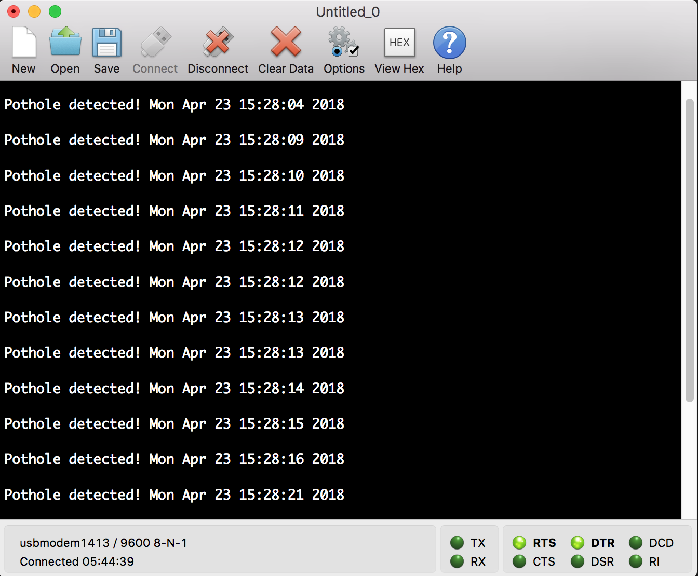

This simple example demonstares pothole detection using accelerometer and free-fall interrupt. Date and time is also displayed using real-time clock.

The project is forked from mbed os examples and modified.

## Used board and sensor
 The application uses [X-NUCLEO-IKS01A2](http://www.st.com/en/ecosystems/x-nucleo-iks01a2.html)'s built-in [LSM6DSL](http://www.st.com/en/mems-and-sensors/lsm6dsl.html) accelerometer sensor on top of the [NUCLEO-F401RE](http://www.st.com/en/ecosystems/x-nucleo-iks01a2.html) board.

## Dependencies
The example uses [The official mbed C/C++ SDK](https://os.mbed.com/users/mbed_official/code/mbed/) and the [library](https://os.mbed.com/teams/ST/code/X_NUCLEO_IKS01A2/) for X-NUCLEO-IKS01A2.

## Build
The easiest way is to use online IDE provided by Mbed : https://os.mbed.com/. 
After creating account for the online IDE on the website follow following steps:
1. Create a new file main.cpp and copy the code from here to the new created main.cpp
2. Add above dependecies
3. Use **Compile** menu to build and download the binary file (automatically started)
4. Connect your device
5. Drag and drop the downloaded binary file to the device
6. Use terminal tools such as [CoolTerm](http://freeware.the-meiers.org/) to the connect serial port 

## Notes
The real-time clock is using unix time, you can convert time to the unix time using [this website](https://www.epochconverter.com/) and set the time to desired time by changing following value ``set_time(1524497278);`` on the main.cpp file

## References
https://os.mbed.com/teams/ST/code/FreeFall_IKS01A2/file/3aa150c1a624/X_NUCLEO_IKS01A2.lib/

